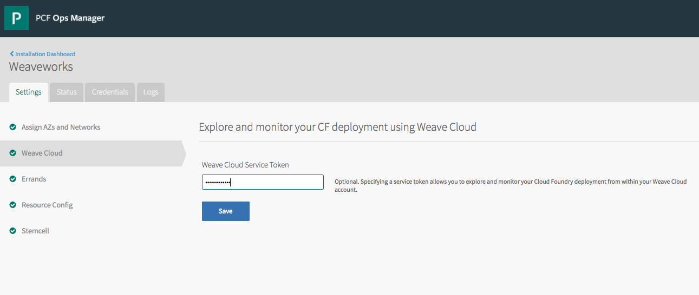
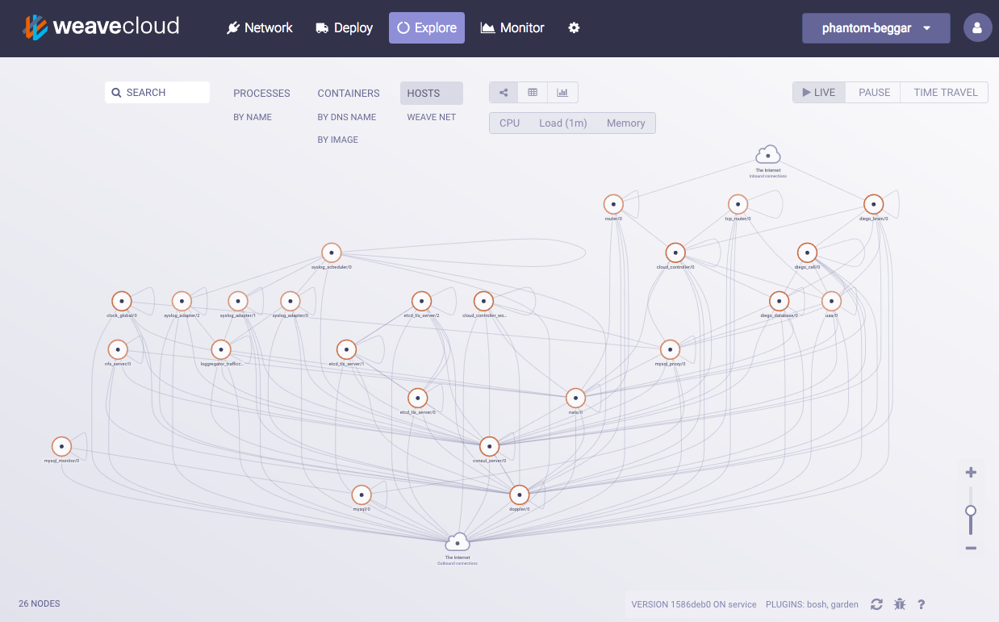
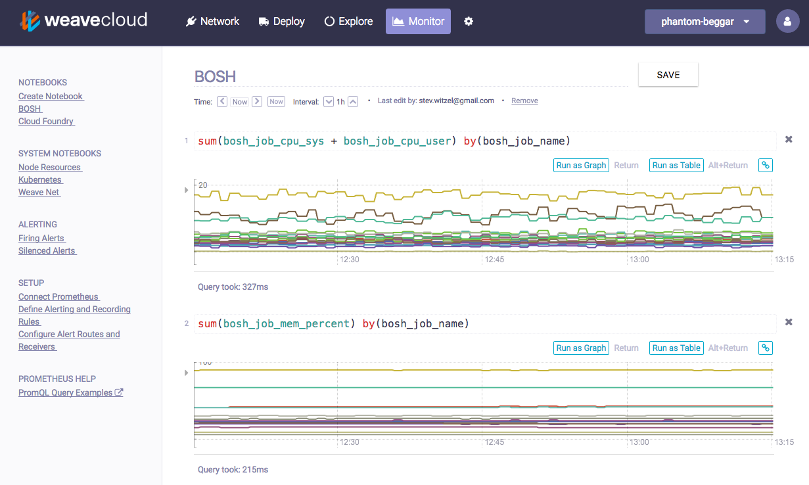
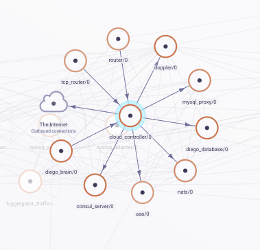
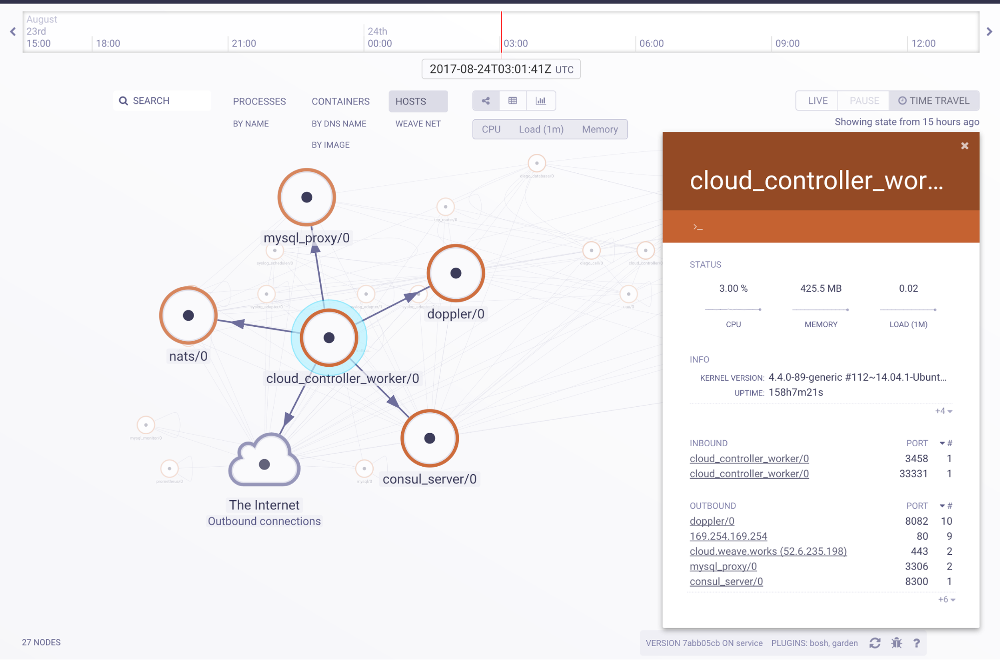
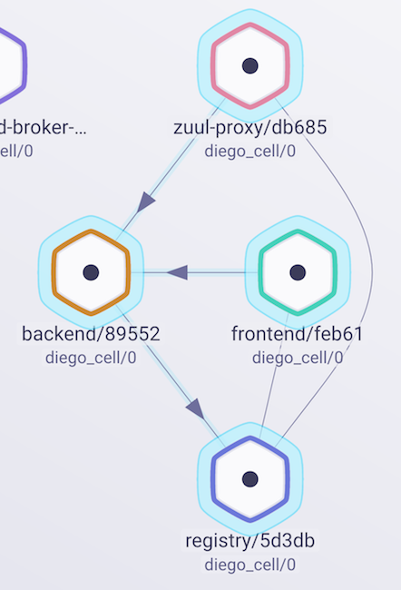
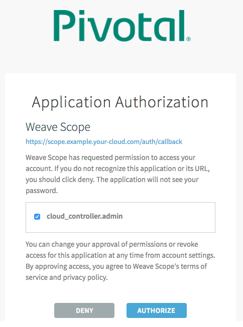
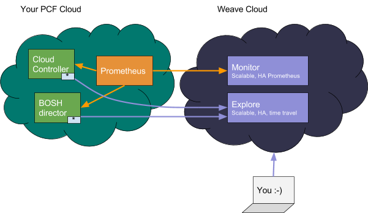
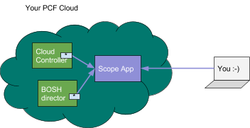

The Weave Cloud Service Broker for Pivotal Cloud Foundry (PCF) tile enables operators and app developers to track all system and application metrics from their PCF installation in one place:

 - [What is Weave Cloud?](#overview)
 - [Key Features](#features)
   - [Product Snapshot](#snapshot)
 - [Download Weave Cloud Broker for PCF](#download)
   - [Requirements](#reqs)
   - [Prerequisites](#prerequisites)
 - [How to install it](#installing)
 - [Weave Cloud Integration with PCF](#wc-integration)
   - [Querying BOSH Metrics with Weave Cloud](#BOSH-metrics)
 - [How to Use Weave Cloud with Cloud Foundry](#wc-cloud-foundry)
   - [Weave Cloud Explore for Cloud Foundry](#wc-explore-cloud-foundry)
   - [Weave Cloud Monitor for Cloud Foundry](#wc-monitor-cloud-foundry)
   - [Weave Cloud Explore (Scope) Standalone](#wc-scope)
 - [How it works](#how)
   - [Weave Cloud Explore](#wc-explore)
      - [Authorizing the Scope App](#authorize)
   - [Weave Cloud Monitor](#wc-monitor)
   - [Explore & Monitor (integrated with Weave Cloud)](#wc-explore-monitor)
   - [Explore only (standalone, without Weave Cloud)](#explore-only)
- [A note about this version](#version)
- [How to Contact Weaveworks](#contact-weave)
- [Pivotal Feedback](#feedback)
- [Trial License](#licence)

## What is Weave Cloud?

[Weaveworks](https://www.weave.works) is building a one-click ops platform for development teams by baking in the operational expertise to deploy, explore, and monitor apps and services running in a cluster. Weave Cloud is the ops platform. Weave Cloud Service Broker for PCF allows Pivotal PCF users to use the [explore](https://www.weave.works/docs/cloud/latest/concepts/explore-and-troubleshoot/) and [monitor](https://www.weave.works/docs/cloud/latest/concepts/prometheus-monitoring/) features of Weave Cloud.

The target audience for the Weave Cloud PCF tile are Pivotal Cloud Foundry users: that is, people who are deploying, monitoring, and operating their applications on PCF

## Key Features

Weave Cloud Service Broker for PCF includes the following key features:

* **PCF monitoring**: Collects metrics emitted by all components of PCF
* **IaaS-level monitoring**: Collects metrics from CPU, memory usage, IO, network, VM states, and more, regardless of the underlying infrastructure
* **Third-party services monitoring**: Provides the ability to collect metrics from MySQL, PostgreSQL, Redis, and RabbitMQ
* **Application monitoring**: Gathers standard metrics (CPU, memory, or disk usage), arbitrary metrics (gauges, counters, timings, sets),
  and HTTP-specific metrics (requests per second, status codes, error rates, and more)
* **SSO and multi-tenancy**: Uses the Cloud Foundry UAA service
  to control access to apps and resources based on user roles and rights within the platform.
  Multi-tenancy is implemented according to Cloud Foundry UAA roles.
  Dedicated shares of the solution are deployed to different spaces to collect metrics from the apps and services running within.
* **Alerts**: Can be defined for each dashboard panel, and allow users to get immediate notifications though email, Slack, and other notification channels.

### Product Snapshot

The following table provides version and version-support information about Weave Cloud Service Broker for PCF.

<table class="nice">
    <th>Element</th>
    <th>Details</th>
    <tr>
        <td>Tile version</td>
        <td>v1.0.2</td>
    </tr>
    <tr>
        <td>Release date</td>
        <td>October 25, 2017</td>
    </tr>
    <tr>
        <td>Software component version</td>
        <td>Grafana v4.4.1, collectd v5.7.2, StatsD v0.8.0, carbonapi 0.8.0, carbon-c-releay 3.1, carbonzipper 0.73.2 and go-carbon 0.10.1</td>
    </tr>
    <tr>
        <td>Compatible Ops Manager version(s)</td>
        <td>v1.10.x and v1.11.x</td>
    </tr>
    <tr>
        <td>Compatible Elastic Runtime version(s)</td>
        <td>v1.10.x and v1.11.x</td>
    </tr>
    <tr>
        <td>IaaS support</td>
        <td>AWS and OpenStack</td>
    </tr>
    <tr>
        <td>IPsec support?</td>
        <td>No</td>
    </tr>
</table>

## Download Weave Cloud Broker for PCF

Download the Weave Cloud Service Broker  PCF tile from the Pivotal Network at https://network.pivotal.io/products/p-weave.

### Prerequisites

To complete installation of Weave Cloud Service Broker for PCF, you need the following:

* An AWS S3 bucket or WebDAV with credentials to store alert images from Grafana
* Alert notification endpoint (SMTP server for email notifications, Slack, Sensu) with credentials
* CPU, RAM, and disk resources for seven VMs
* Internet connectivity between the networks where the PCF deployment and Heartbeat are installed.
  Altoros recommends installing Heartbeat on the same network with PCF.
* TCP 2003 and 8126, and UDP 8125 ports open in the firewall to accept connections from PCF and services networks. Ports 2003 and 8125 are used to receive metrics. TCP 8126 is necessary for Load Balancer health checks.

### Requirements

Weave Cloud PCF has the following requirements:

* [Elastic Runtime](https://network.pivotal.io/products/elastic-runtime) v1.10.x, v1.11.x
* [Ops Manager](https://network.pivotal.io/products/ops-manager) v1.10.x, v1.11.x
* Installation of the collectd add-on for PCF to enable PCF component VMs and
  the VMs of any other BOSH-deployed services expose system metrics to Heartbeat.
For more information, see [Installing collectd Add-on for PCF](installing.html).
* (Optional) If you want to enable collection of JMX metrics from Java apps, you will need a custom Java buildpack for Weave Cloud Service Broker for PCF.
For more information, see [JMXTrans Agent Integration](jmxtrans.html).
* (Optional) If you want to enable collection of custom application metrics, you must integrate a StatsD library into the app's code.
  For more information, see [StatsD Integration](statsd.html).

##  How to install it

After [downloading the tile](#download), import it into Pivotal Ops Manager and then. After importing, assign availability zones and networks in the tile settings tab.

Once the network assignments are configured, you can either choose to set up the tile to integrate with your [Weave Cloud account](#wc-integration) or you can run [Weave Scope] inside your own cloud.

## Weave Cloud Integration with PCF

To explore and monitor your Cloud Foundry deployment from within Weave Cloud, provide the [service token from your Weave Cloud](https://www.weave.works/docs/cloud/latest/install/installing-agents/#weave-cloud) account. After you’ve created an instance, the service token is located in the upper left-hand corner of the installation screen. Copy token to the Weave Cloud Service token field on the PCF Ops Manager settings tab.  

The Cloud Foundry platform integration supports only the [Explore](https://www.weave.works/docs/cloud/latest/concepts/explore-and-troubleshoot/) and [Monitor](https://www.weave.works/docs/cloud/latest/concepts/prometheus-monitoring/) features of Weave Cloud.

After you’ve entered the service token correctly in the PCF Ops Manager, go to Weave Cloud and click Explore, where you should see something similar to the screen capture shown below:

### Querying BOSH Metrics with Weave Cloud

Weave Cloud includes a time-series interface for querying BOSH metrics. In this instance CPU and Memory usage are graphed:

## How to Use Weave Cloud with Cloud Foundry

### Weave Cloud Explore for Cloud Foundry

Explore allows you to visualize a live map of your Cloud Foundry platform. This has been described as "seeing Cloud Foundry for the first time". As a Cloud Foundry operator, it helps you understand and teach people about the system, as well as debug issues with your Cloud Foundry deployment. For example, you can ask "what's the Cloud Controller doing?"

You can see the outbound connections that it's making to NATS, the Consul server, etc.

Using Weave Cloud, you can even travel back in time and ask questions like "What was the Cloud Controller Worker doing at 3am this morning?"

As well as seeing individual VMs in the live map that Explore gives you, it can also show you the relationships between different containerized apps running on the platform:

For example you can see the relationships between the containers (diego cells) that make up the [Spring Boot Eureka Demo](https://github.com/cloudfoundry-incubator/cf-networking-release/tree/develop/src/example-apps/eureka), and also demonstrate CloudFoundry's CNI support for direct container-to-container communications.

### Weave Cloud Monitor for Cloud Foundry

Monitor allows you to gather and push time-series metrics about the health of the Cloud Foundry platform itself, including metrics about e.g. CPU and memory usage, how many apps are running, and other metrics that are valuable for a PCF operator.

For example, here we can group the CPU usage in the system by the BOSH job it corresponds to:

### Weave Cloud Explore (Scope) Standalone

As an alternative to integrating with Weave Cloud, you can deploy an instance of the Weave Scope App inside your own cloud. To do this, leave the Weave Cloud Service Token field empty and then select Resource Config and set the number of Weave Scope App instances to one or more.

Once you've made your changes to the tile configuration, click the Apply Changes button in Ops Manager and go for a coffee.

## How it works

### Weave Cloud Explore

The Weave Cloud PCF tile instructs BOSH to co-locate the Scope Agent with every VM inside your Cloud Foundry deployment. Depending on how you have configured the tile, the agents send reports about the VMs to either Weave Cloud or a Weave Scope App running inside your own cloud.

After you’ve configured the tile to deploy a standalone Scope App inside your own cloud, point your browser to https://scope.<your-pcf-system-domain> to explore your Cloud Foundry deployment.

#### Authorizing the Scope App

The standalone Scope App integrates with Cloud Foundry’s User Account and Authentication (UAA) Server. In order to use the app, login as a cloud_controller.admin user and authorize Weave Scope.

If the PCF tile is configured to work with Weave Cloud, you can explore your Cloud Foundry deployment by signing into your Weave Cloud account and going to the Explore tab.

### Weave Cloud Monitor

When configured with Weave Cloud, the tile deploys a VM running Prometheus that scrapes metrics from a number of targets such as the BOSH director and the Cloud Foundry Cloud Controller. Those metrics are then forwarded to Weave Cloud where you can query them in the Monitor tab using PromQL.

### Explore & Monitor (integrated with Weave Cloud)

If a Weave Cloud token is entered during the installation, Prometheus is deployed in a separate VM in your PCF cloud. Prometheus scrapes metrics from the Cloud Controller and BOSH director and then forwards them on to Weave Cloud, where they can be easily queried and graphed.

Additionally, the Explore Agent (aka Scope Agent), shown with a * on the diagram, is installed on the relevant VMs, and configured to push information to Weave Cloud, both for the platform components and also containerized apps running in Diego Cells.

### Explore only (standalone, without Weave Cloud)

In standalone mode, without Weave Cloud,  only the Explore functionality is available.

## A note about this version

The overall solution should be considered **alpha quality**.

The Weave Cloud PCF tile, as well as the Scope Plugins for BOSH and Garden are considered alpha-quality software and as such do have some limitations:

* The offline buildpack for collecting JMX metrics is unavailable and only the online version of the buildpack from
  [this GitHub repository](https://github.com/Altoros/java-buildpack#jmx-agent-integration) can be used to collect JMX metrics from Java apps.
* Users are limited to using internal MariaDB to store internal Heartbeat data such as user sessions, mappings, dashboards, UI configs, etc.
* Downscaling with retained high availability is only possible for at least two back-end instances.

The Weave Cloud agents (aka Scope Probe, and the Prometheus instance configured to push metrics to Weave Cloud) and Weave Cloud itself are production-ready.

Please try it out on your dev and test environments and give us feedback on how it goes!

## How to Contact Weaveworks

If you have any questions or comments you can reach out to us on our [#weave-community](https://weave-community.slack.com/messages). To invite yourself to the Community Slack channel, visit [Weave Community Slack invite]( https://weaveworks.github.io/community-slack/) or contact us through one of these other channels at [Help and Support Services](https://www.weave.works).

##  Pivotal Feedback

Please provide any bugs, feature requests, or questions to the
[Pivotal Cloud Foundry Feedback](mailto:pivotal-cf-feedback@pivotal.io) list or send an email to [Altoros Customer Support](mailto:pcftiles-support@altoros.com).

## Trial License

Users interested in Heartbeat can sign up for a [free trial](https://www.altoros.com/wp-content/uploads/2017/07/AltorosHeartbeatTileEULA.pdf).
